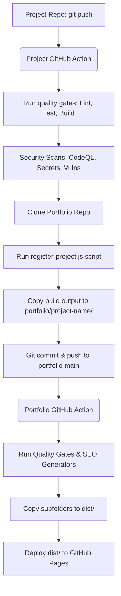

# Automated GitHub Portfolio Ecosystem Architecture

This document defines the architecture, folder structure, deployment strategy, and configuration required to transform the developer portfolio ecosystem into a fully automated platform. 

The goal is to eliminate manual deployment steps: when code is pushed to any sub-project repository, GitHub Actions automatically compiles it, registers its metadata, updates the portfolio's project index, and deploys it to the correct public URL.

---

## 1. Monorepo vs. Multi-Repo Recommendation

For this ecosystem, we recommend a **Multi-Repo Architecture** with a **Central Deployment Hub**:
- **Why Multi-Repo?** Projects like `techscript` (a Rust compiler), `vortyx` (a CLI tool), and `novos` (a Web OS) use completely different languages, build pipelines, dependencies, and environments. Keeping them in separate repositories avoids a monolithic, slow-to-build, and hard-to-maintain workspace.
- **How it integrates**: The `portfolio` repository acts as the **central deployment host**. Each individual project repository runs its own independent CI/CD pipeline and pushes its compiled output into a designated subfolder of the `portfolio` repository, which automatically triggers a GitHub Pages deploy.

---

## 2. Repository Architecture & Deployment Flow

Below is the orchestration flow when a developer runs `git push` on a project repository:



### Path Mapping
- Main site: `https://tanmoy.is-a.dev` (from `portfolio` repo root)
- Sub-projects: `https://tanmoy.is-a.dev/<project-name>` (mapped to `/dist/<project-name>/index.html`)
- Independent projects: `https://techscript.is-a.dev` (independent custom domain via its own CNAME in the `techscript` repository)

---

## 3. Directory Layouts

### Portfolio Repository Layout
```
portfolio/
├── .github/
│   └── workflows/
│       └── deploy.yml          # Portfolio build, test, and deploy workflow
├── automation/
│   └── templates/
│       └── project-deploy-template.yml  # Reusable template for sub-projects
├── scripts/
│   ├── register-project.js     # Updates showcase.json with metadata & GitHub stats
│   └── generate-seo-assets.js  # Dynamically generates sitemap, robots.txt, RSS, and search index
├── src/
│   ├── content/
│   │   └── projects/
│   │       └── showcase.json   # Dynamically updated project registry
│   └── ...
├── public/
│   └── CNAME                   # Custom domain (tanmoy.is-a.dev)
├── vortex/                      # Automatically pushed compiled build from vortex repo
│   └── index.html
├── aurora/                      # Automatically pushed compiled build from aurora repo
│   └── index.html
└── ...
```

### Sub-Project Repository Layout (e.g. `vortex/`)
```
vortex/
├── .github/
│   └── workflows/
│       └── deploy.yml          # Copy of project-deploy-template.yml
├── portfolio-metadata.json      # Metadata file describing the project
├── src/
├── package.json
└── ...
```

---

## 4. Automation Components

### A. Dynamic Project Registration (`register-project.js`)
When a sub-project finishes its build, it clones the `portfolio` repo and invokes `register-project.js`. The script:
1. Parses the project's `portfolio-metadata.json`.
2. Queries the GitHub API to fetch:
   - Stars, forks, and open issues.
   - Contributor count.
   - Latest release version and release notes.
3. Automatically inserts or updates the project entry inside `portfolio/src/content/projects/showcase.json`.
4. Updates the "Last Updated" timestamp for the portfolio.

### B. SEO & Asset Generation (`generate-seo-assets.js`)
Triggered during the portfolio's build workflow. The script:
- Loops over `showcase.json` and local subdirectories containing an `index.html`.
- Generates `sitemap.xml` including all subfolders (`/vortex`, `/aurora`, etc.) with correct canonical URLs.
- Generates `robots.txt` pointing to the sitemap.
- Generates `search-index.json` containing searchable metadata of all projects for high-speed client-side search.
- Generates an RSS/Atom feed containing updates for releases and projects.

### C. Build Isolation & Output Merging
Vite normally clears the output directory `dist/` before writing its build. The updated portfolio workflow prevents this from deleting subfolder builds by building Vite first, and then copying all project subfolders (like `vortex/`, `aurora/`) into `dist/` before uploading to GitHub Pages.

---

## 5. Security & GitHub Credentials

### GitHub Authentication Design
To allow sub-project repositories to push changes to the `portfolio` repository, we require authentication.
- **Avoid Personal Access Tokens (PATs)**: PATs are tied to individual developer accounts and are difficult to rotate.
- **Recommended: GitHub App**: Create a dedicated private GitHub App (e.g. "Portfolio Sync Bot") owned by your GitHub account:
  1. Grant **Repository Permissions**:
     - `Contents`: Read & Write (to push to the `portfolio` repo)
     - `Metadata`: Read-Only
  2. Install the App on your user account (limiting access to `portfolio` and your sub-project repos).
  3. Download the Private Key and note the App ID.
  4. In each sub-project repository, add:
     - `PORTFOLIO_SYNC_APP_ID`: The App ID.
     - `PORTFOLIO_SYNC_PRIVATE_KEY`: The App's private key.
  
Using a GitHub App allows you to generate short-lived installation access tokens automatically in the Actions workflow, making the system highly secure and compliant with least-privilege principles.

### Required Secrets Summary

| Secret Name | Location | Description |
| :--- | :--- | :--- |
| `PORTFOLIO_SYNC_APP_ID` | Sub-project repos | The App ID of the GitHub App |
| `PORTFOLIO_SYNC_PRIVATE_KEY` | Sub-project repos | The Private Key of the GitHub App |
| `GITHUB_TOKEN` | All repos | Handled automatically by GitHub Actions for local repo read/write |

---

## 6. Optimization & Caching Strategy

To ensure builds run as quickly as possible and stay within GitHub Free limits (2,000 minutes/month):
- **Dependencies Cache**: Use `actions/setup-node` with `cache: 'npm'` to cache `node_modules`. For Rust projects (like TechScript or Vortyx), use `Swatinem/rust-cache` to cache compiled target crates.
- **Build Caching**: Cache Vite’s `.vite` cache directory if building large applications.
- **MIME & Image Optimization**: Compress images during project builds (`imagemin-lint` or `vite-plugin-image-optimizer`) before pushing to the portfolio repo to minimize bandwidth usage and Git history bloating.

---

## 7. Quality Gates & Error Policies

Every project build must pass quality gates:
1. **Linting**: Running `npm run lint` / `cargo clippy`.
2. **Formatting**: Running `npx prettier --check .` / `cargo fmt --check`.
3. **Type Check**: Running `npx tsc --noEmit`.
4. **Security Scan**: Using CodeQL or `npm audit` / `cargo audit` to scan for known vulnerabilities.
5. **Testing**: Running unit and integration tests.

If any check fails, the workflow terminates immediately, preventing broken code or metadata from reaching the `portfolio` repository.

---

## 8. Rollback and Error Recovery Strategy

Since Git controls the entire automated pipeline, rollbacks are simple and instantaneous:
- **How to Roll Back**: If a buggy version of `vortex` is pushed, go to the `portfolio` repository, revert the commit that added `vortex`, and push. The portfolio action will run and immediately deploy the previous stable version.
- **Build Failures**: If a push to a project repository fails during build or lint steps, the workflow halts and does *not* push to the `portfolio` repo. The live portfolio site remains completely unaffected.
- **Discord/Slack Webhooks**: Add a notification step at the end of the workflows to send instant alerts on failures.
