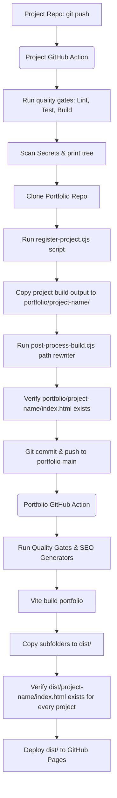

# Automated GitHub Portfolio Ecosystem Architecture

This document defines the architecture, folder structure, deployment strategy, and configuration required to transform the developer portfolio ecosystem into a fully automated platform. 

The goal is to eliminate manual deployment steps: when code is pushed to any sub-project repository, GitHub Actions automatically compiles it, registers its metadata, updates the portfolio's project index, and deploys it to the correct public URL.

---

## 1. Monorepo vs. Multi-Repo Recommendation

For this ecosystem, we recommend a **Multi-Repo Architecture** with a **Central Deployment Hub**:
- **Why Multi-Repo?** Projects like `techscript` (a Rust compiler), `vortyx` (a CLI tool), and `novos` (a Web OS) use completely different languages, build pipelines, dependencies, and environments. Keeping them in separate repositories avoids a monolithic, slow-to-build, and hard-to-maintain workspace.
- **How it integrates**: The `portfolio` repository acts as the **central deployment host**. Each individual project repository runs its own independent CI/CD pipeline and pushes its compiled output into a designated subfolder of the `portfolio` repository, which automatically triggers a GitHub Pages deploy.

---

## 2. Repository Architecture & Deployment Flow

Below is the orchestration flow when a developer runs `git push` on a project repository:



### Path Mapping
- Main site: `https://tanmoy.is-a.dev` (from `portfolio` repo root)
- Sub-projects: `https://tanmoy.is-a.dev/<project-name>` (mapped to `/dist/<project-name>/index.html`)
- Independent projects: `https://techscript.is-a.dev` (independent custom domain via its own CNAME in the `techscript` repository)

---

## 3. Directory Layouts

### Portfolio Repository Layout
```
portfolio/
├── .github/
│   └── workflows/
│       └── deploy.yml          # Portfolio build, test, and deploy workflow
├── automation/
│   └── templates/
│       └── project-deploy-template.yml  # Reusable template for sub-projects
├── scripts/
│   ├── register-project.cjs     # Updates showcase.json with metadata & GitHub stats
│   ├── generate-seo-assets.cjs  # Dynamically generates sitemap, robots.txt, RSS, and search index
│   ├── post-process-build.cjs   # Rewrites root-relative URLs in sub-project build output
│   └── validate-deployment.cjs  # Strict validation gate that fails deployment if folders/files are missing
├── src/
│   ├── content/
│   │   └── projects/
│   │       └── showcase.json   # Dynamically updated project registry
│   └── ...
├── public/
│   └── CNAME                   # Custom domain (tanmoy.is-a.dev)
├── vortex/                      # Automatically pushed compiled build from vortex repo (contains index.html)
├── aurora/                      # Automatically pushed compiled build from aurora repo (contains index.html)
└── ...
```

---

## 4. Redesigned Deployment Strategy & Path Correction

### A. The 404 Problem
Vite and other React/Next frameworks by default compile assets with absolute root paths (e.g. `src="/assets/index.js"`). If deployed under a portfolio subfolder (`tanmoy.is-a.dev/vortex/`), the browser attempts to fetch assets from the root domain (`tanmoy.is-a.dev/assets/index.js`), causing a 404.

### B. Path Rewriter (`post-process-build.cjs`)
To solve this automatically, the sub-project workflow executes `post-process-build.cjs` on the copied files in `portfolio/<project-name>/`.
- **For HTML files**: Rewrites all root-relative `src`, `href`, and `content` attributes (e.g. `href="/favicon.ico"` becomes `href="/vortex/favicon.ico"`).
- **For JS, CSS, JSON, WebManifest**: Rewrites common asset paths (e.g. `"/assets/"` ➔ `"/vortex/assets/"`).

---

## 5. Strict Quality Gates & Debugging

To prevent broken deployments:
1. **Directory Tree Debugging**: Workflows install `tree` and print the directory trees before and after key steps (e.g. build directories, portfolio checkout, final merged `dist/` directory) to make debugging fast and transparent.
2. **Sub-Project Validation**: In the project workflow, `Verify Synced index.html Exists` fails the build immediately if `portfolio/<project-name>/index.html` is missing after copying.
3. **Portfolio Validation**: In the portfolio workflow, `Validate Deployed Files` matches the directory list with `showcase.json` and verifies that every project exists under `dist/<project-name>/index.html`. If any directory is missing or empty, **the deployment is aborted**.

---

## 6. GitHub Authentication & Secrets

To allow sub-projects to commit to the `portfolio` repo, create a private **GitHub App** and add the credentials as repository secrets:
- `PORTFOLIO_SYNC_APP_ID`: The App ID.
- `PORTFOLIO_SYNC_PRIVATE_KEY`: The App's private key.
